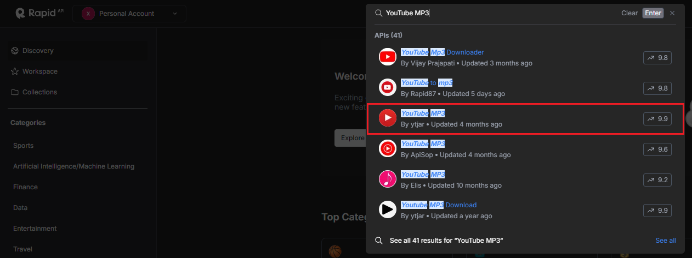
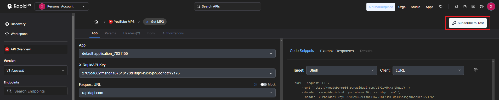
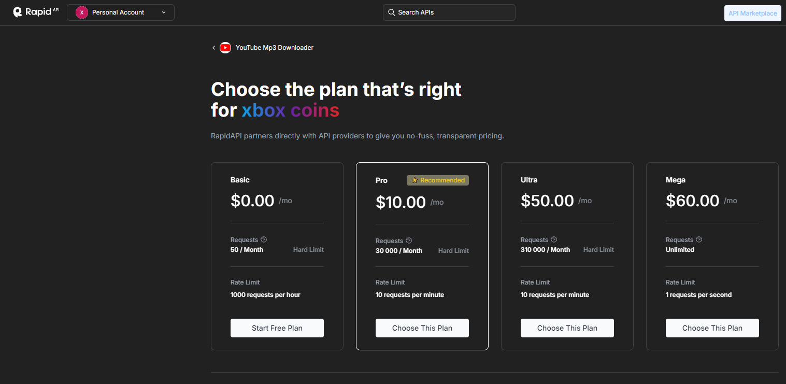
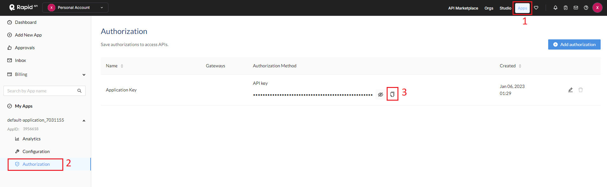

# YTtoMP3

## How to Run the Project Locally

### Requirements

To run this project locally, ensure you have the following software installed on your machine:

- **Node.js**: Version 14 or higher
- **npm**: Version 6 or higher (comes with Node.js)
- **Vite**: Vite is a build tool that provides a faster and leaner development experience for modern web projects.

### Installing Required Packages

Before running the project, you need to install the necessary packages. These packages are defined in the `package.json` file. You can install them using npm by running the following command in your terminal:

```bash
npm install
```

### Running the Project Locally

Once you have all the dependencies installed, you can start the development server using Vite. Run the following command:

```bash
npm run dev
```

This command will start the Vite development server. By default, the project will be available at `http://localhost:3000`. You can open this URL in your browser to view the application.

## How to Create an API Key on RapidAPI

To use the YouTube to MP3 conversion functionality, you'll need to obtain an API key from RapidAPI. Follow these three simple steps to create your API key:

### Step 1: Sign Up and Log In to RapidAPI

Go to [RapidAPI's website](https://rapidapi.com) and sign up for a free account if you don't have one. If you already have an account, log in.

### Step 2: Find and Subscribe to the API

Search for the [YouTube MP3 by ytjar](https://rapidapi.com/ytjar/api/youtube-mp36/playground/apiendpoint_4e7a9345-2e05-42c5-8357-cc0dbb8c27b8) API in the RapidAPI marketplace. Once you've found it, click on it to view its details.



Subscribe to the API by selecting the free or paid plan that suits your needs.




### Step 3: Copy Your API Key

1. After subscribing, navigate to the "Apps" tab of the API.
2. Select "default application" on the sidebar and click Authorization.
3. Here, you will find your API key in the "X-RapidAPI-Key" field. Copy this key, as you will need to add it to your project.



### Configuring the API Key in Your Project

Once you have your API key, you'll need to set it up in your project:

1. Create a `.env` file in the root of your project directory.
2. Add the following line to your `.env` file, replacing `YOUR_API_KEY` with the actual key you copied:

```plaintext
VITE_RAPID_API_KEY=YOUR_API_KEY
```

3. Save the `.env` file. Your project is now configured to use the RapidAPI service.
